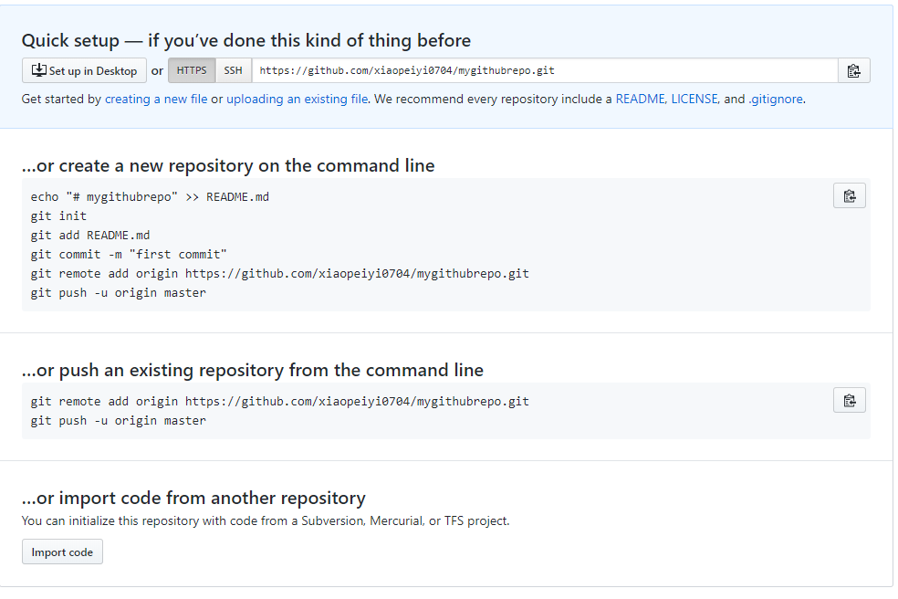

## I. Copyright

All copyright reserved by Peiyi Xiao. Please ask Peiyi Xiao for commercial use. **InComm friendly!**

**Some of contents and images are learned and copied from https://www.liaoxuefeng.com/wiki/0013739516305929606dd18361248578c67b8067c8c017b000.**

If you like it and want donation, please send your donation to xiaopeiyi0704@hotmail.com via PayPal to make author create better tutorial in the future.


## II. Content

This tutorial does **NOT** include following information:

1 How to customize GIT 

2 Command Alias

3 Build GIT server

This tutorial is more than commands, it explains how GIT works and its mechanism and the structure along with practice. If you only want to see the command list, please google it by yourself.


## III. Tool for Practice

Download GIT-BASH for Windows OS to practice. Strongly recommend use CMD line instead of GIT-UI for better understand the mechanism and principle of GIT.


## IV. Create and Delete a Repository

Create a repository, create a folder or go to your working space folder, go inside and do: 

(that means you want to create a repository for this working space )

``` 
git init
```

Before commit you have to add file to tell which file you want to commit

``` 
git add filename
```

If you want to add all files in that folder, you can do

```
git add.
```

Commit the files/change from your working space to your local repository

```
git commit -m "commit message"
```

Delete a local repository

Go to the repository directory ```cd myrepo```, delete the .git file to unassociated the git relationship with the folder ```rm -rf .git``` and then get out the directory ```cd ..``` and delete it the foler ```rm -r myrepo```

```
cd myrepo
rm -rf .git
cd ..
rm -r myrepo
```


## V. Time machine

### 1. Check working space status and difference between committed/latest version

Check current status of repository

``` 
git status
```

Check the difference of a file between committed/latest version and current version

``` 
git diff filename
```

Check the log(commit message) history of each commit. Something like Something like eb77b123dkadfhj12312312 is the version number 

``` 
git log
```

Pretty format check the log(commit message) history of each commit

```
git log --pretty=oneline
```

### 2. Go to a certain version

Go to a previous version of HEAD. 

We know HEAD is current/latest version, previous version is HEAD^, previous previous version is HEAD^^, if we want to go back to the 100th previous version, then we can do HEAD^^....^. Tired? We can do HEAD~100.

```
git reset --hard HEAD^
```

Go to a certain version

```
git reset --hard commit_id/version number
```

If you want to go to a certain version, you have to find the commit id for that version. 

Use `git reflog` or `git log` to check each commit activity. Then you can based on the commit id to do it.

Difference between `git reflog` and `git log`

`git reflog`  show the records of the pointer/go_to/version_switch activity. Ex. head->123@2123->123dee12312->head

`git log` show the records of commit history.

**Before go back to any version from the newer version, you can use `git log` to check commit history and make sure which commit/version you want to go to**

**If you want to go to a later/future version from a older version, you can use `git reflog` to check the go-to activity to make sure which version/commit you want to come back.**

### 3. Concept of Working space-State(index)-Repository

**working space** - the folder your files locate.

**stage (index)** - a staging space after add files and before commit.

**Repository** - a hidden directory called .git in your working space folder.

**Head** - it is a pointer to point a branch/version

**master branch - in git everything is a branch, no trunk (master branch is kind of trunk). The picture is showing the head pointer is pointing to somewhere of master branch. 


``` git add```  is for adding files to stage/index area

``` git commit```  is for submitting all content in stage/index to a branch (master branch in above example)

when we create the GIT repository by ```git init```, GIT automatically creates a master branch (something like trunk in SVN I think).

**QUESTION**

Is that possible that add multiple files to stage and only commit 1 file from stage to the branch?

**ANSWER**

So far as my understanding, no. 

### 4. Follow me for practice

In your repo, create a readme.txt and put some content in it like:

```
Git is a distributed version control system.
SVN is a centralized version control system.
Git has a mutable index called stage.
```

Use ```git status``` to check the status

```
$ git status
On branch master
Untracked files:
  (use "git add <file>..." to include in what will be committed)

        readme.txt

nothing added to commit but untracked files present (use "git add" to track)
```

GIT clearly tells us, there is a file called readme.txt is untracked, which has never been added/committed.

Now let's add it by using ```git add readme.txt```  and then we check the status ```git status``` 

```
$ git status
On branch master
Changes to be committed:
  (use "git reset HEAD <file>..." to unstage)

        new file:   readme.txt
```


Now we can see the readme.txt is added to stage area. Now let's do commit.

```
$ git commit -m "commit readme.txt to master"
[master 661c499] commit readme.txt to master
 Committer: Peiyi Xiao <pxiao@InComm.com>
Your name and email address were configured automatically based
on your username and hostname. Please check that they are accurate.
You can suppress this message by setting them explicitly. Run the
following command and follow the instructions in your editor to edit
your configuration file:

    git config --global --edit

After doing this, you may fix the identity used for this commit with:

    git commit --amend --reset-author

 1 file changed, 3 insertions(+)
 create mode 100644 readme.txt
```

Now do ```git status``` again.

```
$ git status
On branch master
nothing to commit, working tree clean
```

We can see, working tree is clean that means no new change in working space, and nothing left in stage. Now it becomes

 


### 5. Change management

First, let's talk about little bit the difference between SVN and GIT. From my point of view, SVN focus on files and GIT focus on **change **. Let's explain it with an example.

``` Git is a distributed version control system.
Git is a distributed version control system better than svn.
Git is free software under GPL.
Adding a new line here.
```

``` $git add readme.txt
$git add readme.txt
```

As we know, at this point, the change to stage. Before we commit the file, let's modify the file again by adding another line.

``` 
Git is a distributed version control system better than svn.
Git is free software under GPL.
Adding a new line here.
Adding an another new line here.
```

Now, let's commit and see what happens.

```
$ git commit -m 'add lines'
[master 0b3fbcd] add lines
 Committer: Peiyi Xiao <pxiao@InComm.com>
Your name and email address were configured automatically based
on your username and hostname. Please check that they are accurate.
You can suppress this message by setting them explicitly. Run the
following command and follow the instructions in your editor to edit
your configuration file:

    git config --global --edit

After doing this, you may fix the identity used for this commit with:

    git commit --amend --reset-author

 1 file changed, 2 insertions(+)
```

Let's check the status

```
$ git status
On branch master
Changes not staged for commit:
  (use "git add <file>..." to update what will be committed)
  (use "git checkout -- <file>..." to discard changes in working directory)

        modified:   test.txt

no changes added to commit (use "git add" and/or "git commit -a")
```

What? The second change/new line is not committed. Why? Let's review what we did.

Add one line in the file -> git add -> add another line -> commit

I told you that GIT focus on **change** not file. We made the first change and added it to stage about to commit. Before committing it, we made another change but we did not add it to stage. So when we committed, only the first change was committed.

Let's check the difference between working space and repository. The second change is not in sync.

```
$ git diff head -- test.txt
diff --git a/test.txt b/test.txt
index d7a531b..b2a03a2 100644
--- a/test.txt
+++ b/test.txt
@@ -1,3 +1,4 @@
 Git is a distributed version control system better than svn.
 Git is free software under GPL.
-Adding a new line here.
\ No newline at end of file
+Adding a new line here.
+Adding an another new line here.
\ No newline at end of file
```

Let's commit the second change.

```
git add text.txt
git commit -m 'add new line 2'

```

**From the example, we know that GIT focus and tracks changes not files. Without adding to stage (git add) for each change, then the changes will not be committed to repository.**

### 6. Revert change

#### a. Revert change in working space

**```git checkout -- filename```**

Two scenarios:

1 We made changes in working space before adding to stage. - we want to change it back.

2 We made changes and added to stage, and then we made changes again in working space- we want to change it back to the moment just added to the stage.

We can use ``` git checkout -- filename ```  For example, let's change our file like:

```
Git is a distributed version control system better than svn.
Git is free software under GPL.
Adding a new line here.
Adding an another new line here.
Falcons are good.
```

Just check the status:

```
pxiao@ALP-PC0BS4QK MINGW64 ~/gitrepo (master)
$ git status
On branch master
Changes not staged for commit:
  (use "git add <file>..." to update what will be committed)
  (use "git checkout -- <file>..." to discard changes in working directory)

        modified:   test.txt
```

Clearly tell us that the change is not added to stage for commit. Also, it tells us "use ```git checkout -- filename```" to discard changes in working directory". So let's do it.

```
$ git checkout -- test.txt
```

and now the file automatically changes back

```
Git is a distributed version control system better than svn.
Git is free software under GPL.
Adding a new line here.
Adding an another new line here.
```

```$ git checkout -- fielname``` revert all the changes in working space. 

#### b. Revert change in stage ####

**```git reset HEAD filename```**

We made mistakes and added the file to stage (without commit), like:

```
Git is a distributed version control system better than svn.
Git is free software under GPL.
Adding a new line here.
Adding an another new line here.
Falcons are good.
```

```
$ git status
On branch master
Changes to be committed:
  (use "git reset HEAD <file>..." to unstage)

        modified:   test.txt
```

In this case, we can use **```git reset HEAD filename ```** to do the unstage (discard the change in stage)

Let's try it

```
$ git reset HEAD test.txt
Unstaged changes after reset:
M       test.txt
```

```git reset``` **is for both go to a certain version and revert changes in stage.**

let's check the status

```
git status
On branch master
Changes not staged for commit:
  (use "git add <file>..." to update what will be committed)
  (use "git checkout -- <file>..." to discard changes in working directory)

        modified:   test.txt

no changes added to commit (use "git add" and/or "git commit -a")
```

Now, it shows there is difference between stage and working space since we unstaged the change on the stage but in working space still have the change.

Now if we do

```git checkout -- test.txt``` the change in working space is also reverted/discarded.

#### c. Revert change in local repository	

If you made mistakes, add it to stage and commit to local repository. Then you can go back last version by using ``` git --hard HEAD^```  or go back to a certain version by using ```git reset --hard commit_id/version number```. This all happens without commit to remote repository and then you can hide the mistakes change records from others.

If you made change and push to remote repository, you can fix it in your local and push to remote repository again but it is impossible to hide the records of change. 

### 7. Delete files

If we want to delete a file, we can just delete it from our disk.

``` rm test.txt```

After the file is removed, and check the git status

``` 
$ git status
On branch master
Changes not staged for commit:
  (use "git add/rm <file>..." to update what will be committed)
  (use "git checkout -- <file>..." to discard changes in working directory)

        deleted:    test.txt

no changes added to commit (use "git add" and/or "git commit -a")
```

GIT knows the file is removed from your working space, but not sync with the local repository. So we need to remove the file from repository and commit the change.

Delete from GIT local repository.

```$ git rm test.txt
$ git rm test.txt
rm 'test.txt'
```

Commit the deletion change.

```
$ git commit -m 'delete test.txt'
[master aed4980] delete test.txt
 Committer: Peiyi Xiao <pxiao@InComm.com>
Your name and email address were configured automatically based
on your username and hostname. Please check that they are accurate.
You can suppress this message by setting them explicitly. Run the
following command and follow the instructions in your editor to edit
your configuration file:

    git config --global --edit

After doing this, you may fix the identity used for this commit with:

    git commit --amend --reset-author

 1 file changed, 4 deletions(-)
 delete mode 100644 test.txt
```

**Notice**: If we delete a file from working space by mistake, we can get it back by ```git checkout --test.txt```. That we'd learned from Revert change in working space section.


## VI Remote Repository

Here, I will use GITHUB as remote repository for examples. (We may use BITBUCKT or similar at work)

#### 1. Create a GITHUB repository ####

Just sign up a GITHUB account and once login your account click "New repository" button to create a repository in your online GITHUB account. Here, I created a new repository called "mygithubrepo". (You can have many repositories in one GITHUB account)


#### 2. Connecting tools ####

Once you create a repository, it will show you the options along with addresses for communicating with the repository.



1 setup a GIT UI in your desktop

2 HTTPS

3 SSH

##### a. GIT UI #####

You can install GIT UI in your PC and connect with your remote account. I won't talk the details here.

##### b. HTTPS #####

You can use command line to use HTTP protocol to talk to your online GITHUB account. It requires your GITHUB credential when first time connect to your GITHUB account.

##### c. SSH #####

You can use SSH protocol to talk to your online GITHUB account. You can generate RSA key 

``` ssh-keygen -t rsa -C "youremail@xxx.com"``` based on your email address or something else you want. Then it will automatically generate two files, id_rsa (private) and id_rsa.pub (public).  Login your GITHUB account, add and configure your SSH Key in "Account settings".

Once you complete the SSH key setup, the connection between GITHUB online account and your local repository is open since your have the private key in your PC. This is more secure way than others.

#### 3. Connect your local repository with you GITHUB repository ####

Once you create your remote repository, it tells your options that you can connect your local repo  to the remote repo or you can clone a repo based on this repo.

Since we already have a local repo, then I will just connect my existing local repo to the remote repo. Here, I choose HTTP protocol to keep simple. The command is like this:

```
$ git remote add origin https://github.com/xiaopeiyi0704/mygithubrepo.git
```

Now, we have connected to remote repo from our local, but the remote repo is still empty. Now let's push our local repo's stuff to our remote repo.

```
$ git push -u origin master
Counting objects: 23, done.
Delta compression using up to 8 threads.
Compressing objects: 100% (17/17), done.
Writing objects: 100% (23/23), 2.04 KiB | 261.00 KiB/s, done.
Total 23 (delta 3), reused 0 (delta 0)
remote: Resolving deltas: 100% (3/3), done.
remote:
remote: Create a pull request for 'master' on GitHub by visiting:
remote:      https://github.com/xiaopeiyi0704/mygithubrepo/pull/new/master
remote:
To https://github.com/xiaopeiyi0704/mygithubrepo.git
 * [new branch]      master -> master
Branch 'master' set up to track remote branch 'master' from 'origin'.
```

**```origin```**: the default name of remote account, you can change to something else.

**```git push -u origin master```**: check in/push your stuff in master branch to your remote repo's master branch.

***```-u```***: the -u argument in the command means, not only we just push the stuff from local master branch to remote master branch, but also create an association between them. And then in the future, when we do the pull/push request, the command can be shorter.

We connected our local repo to GITHUB remote repo and we also pushed the content to the remote repo. Let's refresh our online account, we can see


The local and remote repo are connected! And the content of is also there! In the future, if we want to push stuff from our local repo to remote repo, we can just do:

```git push origin master```

**Summary**

Connect from your local repo to remote local

```git remote add origin git@server-name:path/repo-name.git```

After the connection, push all your local stuff in master branch to remote

```git push -u origin master```

In the future, push stuff to remote

```git push origin master```

#### 4. Clone repository ####

We already know that if we have local reop first, then how can we create a remote repo and connect with it. But what if we have remote local first? How can we create our local repo based on it? Let's do it!

Let's create a repo in GITHUB called "remotefirst" and create a readme file in it.


Now, the remote repo is ready. Let's create a local repo based on clone remote repo by using ```git clone remote_address```

```$ git clone https://github.com/xiaopeiyi0704/remotefirst.git
$ git clone https://github.com/xiaopeiyi0704/remotefirst.git
Cloning into 'remotefirst'...
remote: Enumerating objects: 3, done.
remote: Counting objects: 100% (3/3), done.
remote: Total 3 (delta 0), reused 0 (delta 0), pack-reused 0
Unpacking objects: 100% (3/3), done.
```

Now, let's go the "remotefirst" folder and check

```
pxiao@ALP-PC0BS4QK MINGW64 ~
$ cd remotefirst

pxiao@ALP-PC0BS4QK MINGW64 ~/remotefirst (master)
$ ls
README.md
```

We can see the README.md file from cloning remote repo.


## VII. Branch ##

**In GIT, everything is branch. The trunk in SVN is called master branch in GIT.**

### 1. Create and merge branch ###

In our previous example, we only have one branch, we call it master or master branch. Now let's dig more. Actually, master is a pointer points to GIT commit (let's think each commit is a node). 

**Master**: A pointer points "commit"/node

**Head**: A pointer points another pointer (or a pointe points to where another pointer is pointing to)


If now we create a new branch call it dev, then GIT creates a pointer called dev and points the same node as master pointing to. And then if we let head points to dev, that means we switched to dev branch.


Because this structure, so create a new branch or switch to a different branch in GIT is very fast than SVN. Just create a pointer (dev) and switch head pointer's to point it (dev).

Once we did this, form now on, if we change or commit anything, then all happen in dev branch. For example, if we commit a change, the dev pointer move forward, but master pointer does not change.


If we complete the task in dev, and we want to merge dev to master. The easiest way is let master pointer point dev branch and let head pointer point to master pointer.


So merge in GIT is also fast, just change the pointer.

We can delete the dev branch once the merge is done.


After all above explanation, let's do it via command.

**Create a new branch dev and switch to it**

```$ git checkout -b dev
$ git checkout -b dev
Switched to a new branch 'dev'
```

```$ git checkout -b dev``` means create a branch and switch to it. We also can do it by using two separated command.

**Create a branch** ```git branch branchname``` 

**Switch to a branch** ```git checkout branchname```

```
$ git branch dev
$ git checkout dev
Switched to branch 'dev'
```

**Check branch list and which one is being pointed currently**

```
$ git branch
* dev
  master
```

It shows us that there are two branches and the dev branch is being pointed/used for now.

Now let's make change in dev branch.

```Git is a distributed version control system.
SVN is a centralized version control system.
Git has a mutable index called stage.
Add something for dev branch.
```

let's commit it.

```$ git add readme.txt
pxiao@ALP-PC0BS4QK MINGW64 ~/gitrepo (dev)
$ git add readme.txt
pxiao@ALP-PC0BS4QK MINGW64 ~/gitrepo (dev)
$ git commit -m "change for dev branch"
[dev 8bd3d6c] change for dev branch
 Committer: Peiyi Xiao <pxiao@InComm.com>
Your name and email address were configured automatically based
on your username and hostname. Please check that they are accurate.
You can suppress this message by setting them explicitly. Run the
following command and follow the instructions in your editor to edit
your configuration file:

    git config --global --edit

After doing this, you may fix the identity used for this commit with:

    git commit --amend --reset-author

 1 file changed, 2 insertions(+), 1 deletion(-)
```

Now let's switch to master

```pxiao@ALP-PC0BS4QK MINGW64 ~/gitrepo (dev)
$ git checkout master
Switched to branch 'master'
```

Now it is like this


Now let's check the file. The new added line is not there! Because we are in master not dev!

```Git is a distributed version control system.
SVN is a centralized version control system.
Git has a mutable index called stage.
```

**Merge master to dev branch ** ```git merge branchname```

```$ git merge dev
$ git merge dev
Updating aed4980..8bd3d6c
Fast-forward
 readme.txt | 3 ++-
 1 file changed, 2 insertions(+), 1 deletion(-)
```

```git merge``` is used for merge a certain branch to current branch (in the example, "certain branch" is dev branch, and "current branch" is master branch since we switched to master and head is pointing master)

Now we check the file again, we can see the new added line.

```SVN is a centralized version control system.
SVN is a centralized version control system.
Git has a mutable index called stage.
Add something for dev branch.
```

**Note**

We can see when we merge the branch, it says ```Fast-forward```, which means it is a "fast mode", just let master pointer point to dev address. 

```Fast-forward``` cannot always be used. We cannot use it if there is a confliction. We'll talk about it later.

**Delete the dev branch** ```git branch -d branchname```

 ```pxiao@ALP-PC0BS4QK MINGW64 ~/gitrepo (master)
$ git branch -d dev
Deleted branch dev (was 8bd3d6c).
 ```

and now check the branch list

```pxiao@ALP-PC0BS4QK MINGW64 ~/gitrepo (master)
$ git branch
* master
```

we can see only master branch is there.

**Summary**

check branch list：`git branch`

create branch：`git branch <name>`

switch branch：`git checkout <name>`

create and switch branch：`git checkout -b <name>`

merge certain branch to current branch：`git merge <name>`

delete branch：`git branch -d <name>`

### 2. Merge confliction ###

Sometime, when we merge two branch, we may get confliction. We have to resolve it.

Create and switch to a new branch "feature1"

```pxiao@ALP-PC0BS4QK MINGW64 ~/gitrepo (master)
$ git checkout -b feature1
Switched to a new branch 'feature1'
```

Change the file content in this new branch to cause the confliction

```Git is a distributed version control system.
SVN is a centralized version control system.
Git has a mutable index called stage.
Add something for feature1 branch.
```

Add it and commit

```
pxiao@ALP-PC0BS4QK MINGW64 ~/gitrepo (feature1)
$ git add readme.txt
pxiao@ALP-PC0BS4QK MINGW64 ~/gitrepo (feature1)
$ git commit -m "feature1"
On branch feature1
nothing to commit, working tree clean
```

Switch to master

```pxiao@ALP-PC0BS4QK MINGW64 ~/gitrepo (feature1)
$ git checkout master
Switched to branch 'master'
Your branch is ahead of 'origin/master' by 1 commit.
  (use "git push" to publish your local commits)
```

(GIT also remind us local repo master is 1 commit ahead of remote/origin master branch)

Let change file content in master branch

```SVN is a centralized version control system.
SVN is a centralized version control system.
Git has a mutable index called stage.
Add something for master branch.
```

Add it and commit

```pxiao@ALP-PC0BS4QK MINGW64 ~/gitrepo (master)
$ git add readme.txt
pxiao@ALP-PC0BS4QK MINGW64 ~/gitrepo (master)
$ git commit -m "master"
[master 617ea25] master
 Committer: Peiyi Xiao <pxiao@InComm.com>
Your name and email address were configured automatically based
on your username and hostname. Please check that they are accurate.
You can suppress this message by setting them explicitly. Run the
following command and follow the instructions in your editor to edit
your configuration file:

    git config --global --edit

After doing this, you may fix the identity used for this commit with:

    git commit --amend --reset-author

 1 file changed, 1 insertion(+), 1 deletion(-)
```

Now, **we made change at both branch(not like previous section, we only made change in the dev branch and merge. So from diagram, we have new branch line). **We both commit master and feature1 branches. It looks like


If now we merge them, as we know, we will get confliction since the file is change in the same place. Let's try it

```pxiao@ALP-PC0BS4QK MINGW64 ~/gitrepo (master)
$ git merge feature1
Auto-merging readme.txt
CONFLICT (content): Merge conflict in readme.txt
Automatic merge failed; fix conflicts and then commit the result.
```

**Two branches are merged, but get confliction.** We have to fix the confliction manually and then commit again.

we use ```git status``` it tells which file is conflicted.

Let's open the file and see

```pxiao@ALP-PC0BS4QK MINGW64 ~/gitrepo (master)
SVN is a centralized version control system.
Git has a mutable index called stage.
<<<<<<< HEAD
Add something sdf for master branch.
=======
Add something fsdf and feature1 branch.
>>>>>>> feature1
```

Fix it and commit it again

```pxiao@ALP-PC0BS4QK MINGW64 ~/gitrepo (master|MERGING)
$ git add readme.txt
pxiao@ALP-PC0BS4QK MINGW64 ~/gitrepo (master|MERGING)
$ git commit -m "conflict fixed"
[master 7bcb299] conflict fixed
```

Now it looks as


**Check merge status** ```$ git log --graph --pretty=oneline --abbrev-commit```

```$ git log --graph --pretty=oneline --abbrev-commit
$ git log --graph --pretty=oneline --abbrev-commit
*   7bcb299 (HEAD -> master) conflict fixed
|\
| * 40afec0 (feature1) feature1
* | 617ea25 master
|/
* 8bd3d6c change for dev branch
* aed4980 (origin/master) delete test.txt
* b242b5f add new line 2
* 0b3fbcd add lines
* 661c499 commit readme.txt to master
* c9c1aca add gpl
* e877b35 remove initial txt
* de7a5b3 remove initial txt
* defc2a6 first commit
```

**Delete feature1 branch**

```pxiao@ALP-PC0BS4QK MINGW64 ~/gitrepo (master)
$ git branch -d feature1
Deleted branch feature1 (was 40afec0).
```

**Summary**

Use ```$ git log --graph --pretty=oneline --abbrev-commi``` can check the graph of merge

Use ```git branch -d branchname``` to delete a branch

### 3. Branch management ###

**We already know that Fast forward for merge is very fast, but if we use it, after delete the branch, the branch information will be lost.**

If we force to do NOT use Fast forward mode, GIT will generate a commit during the merge, then we can get the branch information.

Let's create a dev branch and switch to it

``` git chck
$ git checkout -b dev
Switched to a new branch 'dev'
```

Change the file content and commit it

```pxiao@ALP-PC0BS4QK MINGW64 ~/gitrepo (dev)
$ git add readme.txt
pxiao@ALP-PC0BS4QK MINGW64 ~/gitrepo (dev)
$ git commit -m "dev"
[dev 4ebce15] dev
```

Switch to master

```git checkout master```

and merge master and dev

```pxiao@ALP-PC0BS4QK MINGW64 ~/gitrepo (master)
$ git merge --no-ff -m "merge with no-ff" dev
Merge made by the 'recursive' strategy.
 readme.txt | 5 +----
 1 file changed, 1 insertion(+), 4 deletions(-)
```

Because the merge needs a new commit, so we add -m for the commit.

check ```$ git log --graph --pretty=oneline --abbrev-commit```

```pxiao@ALP-PC0BS4QK MINGW64 ~/gitrepo (master)
$ git log --graph --pretty=oneline --abbrev-commit
*   7f13b82 (HEAD -> master) merge with no-ff
|\
| * 4ebce15 (dev) dev
|/
*   7bcb299 conflict fixed
|\
| * 40afec0 feature1
* | a9875e1 master
* | 617ea25 master
```

#### Branch strategy (Good Practice) #### 

1 master is always stable and for release only, NOT for development.

2 development is always at branch.

Here is an example of  a team working on GIT branch (they have their own branch and merge their own branch with dev if needed. Only for release, then merge dev to master and then release from master)


**Summary**

Use `--no-ff` argument in the command to stop Fast forward merge.

For non ff, after merge, you can see there is ever a branch merge from GIT log history.

For ff, after merge, you can not see any history about the branch merge.

### 4. Bug Branch ###

There is one scenario that you are coding and working on dev branch, and then your manager ask you fix a bug and make a hot deployment for it. But you have not finish the dev branch coding part yet. What can we do?

You are working on dev, you made change, but not finish

```pxiao@ALP-PC0BS4QK MINGW64 ~/gitrepo (dev)
$ git status
On branch dev
Changes not staged for commit:
  (use "git add <file>..." to update what will be committed)
  (use "git checkout -- <file>..." to discard changes in working directory)

        modified:   readme.txt

Untracked files:
  (use "git add <file>..." to include in what will be committed)

        .readme.txt.swp

no changes added to commit (use "git add" and/or "git commit -a")
```

**You can store your current work, and back to it later by using ```stash```**

Assume we are currently in dev branch, then we can do

```git stash
pxiao@ALP-PC0BS4QK MINGW64 ~/gitrepo (dev)
$ git stash
Saved working directory and index state WIP on dev: 4ebce15 dev
```

and then switch back to master, because that's the code base to be used for the bug fix.

```
git checkout master
```

and then create a bug branch based on master code base

```
pxiao@ALP-PC0BS4QK MINGW64 ~/gitrepo (master)
$ git checkout -b bug-fix
Switched to a new branch 'bug-fix'
```

After we fix the bug, we commit it

```pxiao@ALP-PC0BS4QK MINGW64 ~/gitrepo (bug-fix)
$ git add readme.txt
pxiao@ALP-PC0BS4QK MINGW64 ~/gitrepo (bug-fix)
$ git commit -m "bug fixed"
[bug-fix 45071d0] bug fixed
 Committer: Peiyi Xiao <pxiao@InComm.com>
Your name and email address were configured automatically based
on your username and hostname. Please check that they are accurate.
You can suppress this message by setting them explicitly. Run the
following command and follow the instructions in your editor to edit
your configuration file:

    git config --global --edit

After doing this, you may fix the identity used for this commit with:

    git commit --amend --reset-author

 1 file changed, 1 insertion(+)
```

Then switch back to master and merge master and the bug-fix branch

```pxiao@ALP-PC0BS4QK MINGW64 ~/gitrepo (bug-fix)
$ git checkout master
Switched to branch 'master'
Your branch is ahead of 'origin/master' by 7 commits.
  (use "git push" to publish your local commits)

pxiao@ALP-PC0BS4QK MINGW64 ~/gitrepo (master)
$ git merge bug-fix
Updating 7f13b82..45071d0
Fast-forward
 readme.txt | 1 +
 1 file changed, 1 insertion(+)
```

and then delete bug-fix branch

```
$ git branch -d bug-fix
Deleted branch bug-fix (was 45071d0).
```

Then we deploy from master branch. Now we can go back to dev to continue our work

```
$ git checkout dev
Switched to branch 'dev'
```

Now we need to get back our code from the "storage" stash.

We can check the stash, and we can see our stuff is there.

```
$ git stash list
stash@{0}: WIP on dev: 4ebce15 dev
```

Now we need to get it back. Two ways:

1 `git stash apply`to get it back, but it won't be deleted from stash. But you can use`git stash drop`to delete it.

2 `git stash pop` to get it back and delete it from stash.

```
$ git stash pop
On branch dev
Changes not staged for commit:
  (use "git add <file>..." to update what will be committed)
  (use "git checkout -- <file>..." to discard changes in working directory)

        modified:   readme.txt

Untracked files:
  (use "git add <file>..." to include in what will be committed)

        .readme.txt.swp

no changes added to commit (use "git add" and/or "git commit -a")
Dropped refs/stash@{0} (f9b74778c73ee44bfccd76ee21165945cd7ee83f)
```

Now we check the stash list

```

```

**Summary**

Use ```git stash``` to store a branch

Use ```git stash list``` to check list available stashed work

Use ```git stash apply``` to get back stuff from stash

Use ```git stash apply stash@{0}``` to get back a certain stash (we may have more than one stash in the list)

Use ```git stash pop``` to get back stuff from stash to branch and delete it from the stash

### 5. Feature branch ###

Now let's assume that we get a task about create a new feature. We do not want to mess up master, so we create a new feature branch and work on it. Let's do it

```pxiao@ALP-PC0BS4QK MINGW64 ~/gitrepo (master)
$ git checkout -b feature-branch
Switched to a new branch 'feature-branch'
```

and made change in the file

```This is feature branch content.```

and commit

```
$ git commit -m "feature branch"
```

Suddenly, we get a call from business team said that we do not want this new feature anymore. Then let's switch to master and then delete feature-branch

```
$ git branch -d feature-branch
error: The branch 'feature-branch' is not fully merged.
If you are sure you want to delete it, run 'git branch -D feature-branch'.
```

Failed! It tells us "feature-branch" is not merged yet, if you delete it, you are going to lost it. But if you still want to delete it, then you can use -D argument.

```
$ git branch -D feature-vulcan
Deleted branch feature-vulcan (was 287773e).
```

Success!

**Summary**

Use ```git branch -D feature-vulcan``` to force delete a branch regardless if it has been merged or not.

### 6. Team work ###

When you clone a repo from remote to your local, you already created the connection between them. **Again, as default ```origin``` is the name of remote repo.**

**Check remote repo information**`git remote`：

```
$ git remote
origin
```

**Check remote repo information with more details** `git remote -v`：

```
$ git remote -v
origin  https://github.com/xiaopeiyi0704/mygithubrepo.git (fetch)
origin  https://github.com/xiaopeiyi0704/mygithubrepo.git (push)
```

Above shows us the address for push and pull. 

#### a. Push ####

**Push is sending your committed stuff in your local repo to corresponding remote repo.**

When you do push, you have to give the branch name. Then GIT automatically push your stuff to corresponding remote repo.

If you push the master branch

```
$ git push origin master
```

if you push the dev branch

```
$ git push origin dev
```

#### b. Pull ####

When you clone a remote repo to your local, ONLY master branch is cloned and displayed. You can try

```
$ git clone https://github.com/xiaopeiyi0704/remotefirst.git
Cloning into 'remotefirst'...
remote: Enumerating objects: 6, done.
remote: Counting objects: 100% (6/6), done.
remote: Compressing objects: 100% (2/2), done.
remote: Total 6 (delta 0), reused 0 (delta 0), pack-reused 0
Unpacking objects: 100% (6/6), done
```

After the clone, check the available branch in your local, you can only see the master branch

```
$ git branch
* master
```

But you also need dev branch since you want to develop in dev branch. Then you have to create the connection to remote dev branch. You can do

```
$ git checkout -b dev origin/dev
Switched to a new branch 'dev'
Branch 'dev' set up to track remote branch 'dev' from 'origin'.
```

Now we have dev branch in local, and we can work on it, make change and push to remote.

```
$ git add README.md

pxiao@ALP-PC0BS4QK MINGW64 ~/remotefirst (dev)
$ git commit -m "dev change3"
[dev 9edeec6] dev change3
 Committer: Peiyi Xiao <pxiao@InComm.com>
Your name and email address were configured automatically based
on your username and hostname. Please check that they are accurate.
You can suppress this message by setting them explicitly. Run the
following command and follow the instructions in your editor to edit
your configuration file:

    git config --global --edit

After doing this, you may fix the identity used for this commit with:

    git commit --amend --reset-author

 1 file changed, 2 insertions(+), 1 deletion(-)


$ git push origin dev
Counting objects: 3, done.
Delta compression using up to 8 threads.
Compressing objects: 100% (2/2), done.
Writing objects: 100% (3/3), 293 bytes | 146.00 KiB/s, done.
Total 3 (delta 0), reused 0 (delta 0)
To https://github.com/xiaopeiyi0704/remotefirst.git
   74fb25d..9edeec6  dev -> dev
```

If you teammate also made change in dev, and changed the same file as you made, and try to push

```
$ cat README.md

$ git add README.md

$ git commit -m "add new README"
[dev 7bd91f1] add new env
 1 file changed, 1 insertion(+)
 create mode 100644 env.txt

$ git push origin dev
To https://github.com/xiaopeiyi0704/remotefirst.git
 ! [rejected]        dev -> dev (non-fast-forward)
error: failed to push some refs to 'https://github.com/xiaopeiyi0704/remotefirst.git'
hint: Updates were rejected because the tip of your current branch is behind
hint: its remote counterpart. Integrate the remote changes (e.g.
hint: 'git pull ...') before pushing again.
hint: See the 'Note about fast-forwards' in 'git push --help' for details.
```

Push failed. Because your teammate's commit has confliction with yours, or his change is not update to date.

Fix it by `git pull`get latest stuff from `origin/dev`, and then merge in local, resolve the confliction and then push.

```
$ git pull
There is no tracking information for the current branch.
Please specify which branch you want to merge with.
See git-pull(1) for details.

    git pull <remote> <branch>

If you wish to set tracking information for this branch you can do so with:

    git branch --set-upstream-to=origin/<branch> dev
```

`git pull` also failed, because the local `dev` branch does not connect to remote `origin/dev` branch. GIT already gives us the reason and tip why and how to resolve it. Just based on that create the connection between `dev` and`origin/dev`

```
$ git branch --set-upstream-to=origin/dev dev
Branch 'dev' set up to track remote branch 'dev' from 'origin'.
```

pull again：

```
$ git pull
Auto-merging README.md
CONFLICT (add/add): Merge conflict in README.md
Automatic merge failed; fix conflicts and then commit the result.
```

Now it is success, we just fix the confliction in the local and push.

```
$ git commit -m "fix conflict"
[dev 57c53ab] fix conflict

$ git push origin dev
Counting objects: 6, done.
Delta compression using up to 4 threads.
Compressing objects: 100% (4/4), done.
Writing objects: 100% (6/6), 621 bytes | 621.00 KiB/s, done.
Total 6 (delta 0), reused 0 (delta 0)
To https://github.com/xiaopeiyi0704/remotefirst.git
   7a5e5dd..57c53ab  dev -> dev
```

So a teamwork is always like that:

1. `git push origin <branch-name>` push your change to remote.
2. if failed, because your local stuff is not update to date, so `git pull` first.
3. if after pull, there is confliction, then resolve it and commit in your local repo.
4. after resolve the confliction or there is no confliction at all, just `git push origin <branch-name>` to push your request to remote.

If`git pull` says `no tracking information`，that means the connection between local branch and remote branch has not been created yet. Just use `git branch --set-upstream-to <branch-name> origin/<branch-name>` to do it.

**Summary**

- Check remote information `git remote -v`；
- The branch created in local without push to remote, then it is no visible for others;
- Use `git push origin branch-name` to push stuff to remote，if failed，use `git pull` to update your local out of date stuff and then commit；
- Create corresponding local branch as remote's, use `git checkout -b branch-name origin/branch-name`，it is better that the local and remote use same branch name;
- Create the connection between local branch and remote's, use `git branch --set-upstream branch-name origin/branch-name`;
- Get stuff from remote, use `git pull`;

**Difference between pull and fetch**

**Git pull**: when you do a **git pull**, it gets all the changes from the remote or central repository and attaches it to your corresponding branch in your local repository.

**Git fetch**: when you do a **git fetch**, it gets all the changes from the remote repository, stores the changes in a separate branch in your local repository and if you want to reflect those changes in your corresponding branches, use a **git merge** to do that.

To summarize,

**git pull = git fetch + git merge**

### 7. Rebase ###

You have to know what is it for?

When you do not want to use it?

Reference https://git-scm.com/book/en/v2/Git-Branching-Rebasing


## VIII. Tag ##

Tag is for commit. 

**Why we need it? **

We want to give a  good name for each commit. 

**Why there is commit id but we still want tag? **

The commit id is not "friendly", we cannot say "hey, can you please check or send me the copy of commit 754993@13112e1231...."?. Or we can say "can you check the commit tip-fix-v1.3"? Which is better? So tag is more meaningful and can be standardized. 

### 1. Create a tag ###

Before creating a tag, you have to switch to the branch where contains the commit you want to create tag for.

```
$ git branch
* dev
  master
$ git checkout master
Switched to branch 'master'
```

Use `git tag <name>` to create a tag

```
$ git tag v1.0
```

Use `git tag` to check all the tags for current branch

```
$ git tag
v1.0
```

If you create a tag, as default, the tag is created for the latest commit. But what if you want to create a tag for an old commit? 

Find the commit, and tag it!

Use `git log --pretty=oneline --abbrev-commit` to get commit history

```
$ git log --pretty=oneline --abbrev-commit
12a631b (HEAD -> master, tag: v1.0, origin/master) merged bug fix 101
4c805e2 fix bug 101
e1e9c68 merge with no-ff
f52c633 add merge
cf810e4 conflict fixed
5dc6824 & simple
14096d0 AND simple
b17d20e branch test
d46f35e remove test.txt
b84166e add test.txt
519219b git tracks changes
e43a48b understand how stage works
1094adb append GPL
e475afc add distributed
eaadf4e wrote a readme file
```

Now we want to tag for "append GPL", its commit id is 1094adb, so we can do

```
$ git tag v0.9 f52c633
```

Now we check tag list `git tag`

```
$ git tag
v0.9
v1.0
```

**Notice**: tag list is not ordered by date time, it is ordered by alphabet. 

we can use `git show <filename>` to check tag information

注意，标签不是按时间顺序列出，而是按字母排序的。可以用`git show <tagname>`查看标签信息：

```
$ git show v0.9
commit f52c63349bc3c1593499807e5c8e972b82c8f286 (tag: v0.9)
Author: Peiyi Xiao <xiaopeiyi0704@hotmail.com>
Date:   Fri May 18 21:56:54 2018 +0800

    append GPL

diff --git a/readme.txt b/readme.txt
...
```

We can see `v0.9` tag is for`append GPL` commit.

Also, we can create a tag along with more information by using `-a` to indicate tag name and `-m` for information. Example:

```
$ git tag -a v0.1 -m "version 0.1 released" 1094adb
```

**Again, tag is hooked by commit. If a commit is both in master branch and another branch (can happen when merge without removing the branch , then you will see the tag at both of the branches**

**Summary**

- Use `git tag <tagname>` for creating a tag，as default the tag is for `HEAD` (latest commit)，but also can be a particular commit id；
- Use `git tag -a <tagname> -m "blablabla..." ` to add tag information；
- Use `git tag ` to check the tag list

### 2. Manage tags ###

**Delete a tag**

```
$ git tag -d v0.1
Deleted tag 'v0.1' (was f15b0dd)
```

**Now all the tags happen in local, how to push a tag to remote?**

**Use `git push origin <tagname>`**

```
$ git push origin v1.0
Total 0 (delta 0), reused 0 (delta 0)
To https://github.com/xiaopeiyi0704/remotefirst.git
 * [new tag]         v1.0 -> v1.0
```

**Use `$ git push origin --tags` to push all tags in you local but not in remote to remote**

```
$ git push origin --tags
Total 0 (delta 0), reused 0 (delta 0)
To https://github.com/xiaopeiyi0704/remotefirst.git
 * [new tag]         v0.9 -> v0.9
```

**How to delete a tag in remote**

**delete it from local first**

```
$ git tag -d v0.9
Deleted tag 'v0.9' (was f52c633)
```

**Then delete it from remote. Use push too.**

```
$ git push origin :refs/tags/v0.9
To https://github.com/xiaopeiyi0704/remotefirst.git
 - [deleted]         v0.9
```

**Summary**

- Use `git push origin <tagname> ` to push tag to remote.
- Use `git push origin --tags` to push all tags not in remote yet from local to remotes.
- Use `git tag -d <tagname>` to delete a tag.
- Use `git push origin :refs/tags/<tagname> ` to delete a tag in remote.(use this when the tag is already deleted from local)

## IV. Others ##

### Ignore files ###

In the working space, there are some files you do not want to add to repo for version control. You can create a ".gitignore" file and put ignorance information in it.

For example, .class, .db, .so.... files you do not want them as part of version control contents. In the file you can

```
# comment starts with # in this file
# Windows: 
Thumbs.db
ehthumbs.db
Desktop.ini

# java
.class

# others
.jpg
.png
```

Then we need to add and commit this .gitignore file to GIT.

Sometime, you want to add a file to GIT, but you cannot, because this file is ingored in .gitignore file.

```
$ git add App.class
The following paths are ignored by one of your .gitignore files:
App.class
Use -f if you really want to add them.
```

If you really want to add it, you can use`-f` to force to add it to GIT：

```
$ git add -f App.class
```

Sometime you are not sure why the file cannot be added, but you think it is related to .gitignore file,  then you can do

```
$ git check-ignore -v App.class
.gitignore:3:*.class    App.class
```

Then GIT tells you that .gitignore file 3rd line ignores this type of files. Then we know how to modify it.

**Summary**

Use .gitignore file to add files that want to ignore.

Use ```$ git add -f filename``` to force to add file to GIT even though the file type is in .gitignore file.

Use ```$ git check-ignore -v filename``` to check why the file cannot be added because of the .gitignore file.


## V. Other tutorials  ##

Please contact with Peiyi Xiao if you are interested at any of following tutorials.

Spring boot (Spring boot 3+, REST, Spring data JPA, Bootstrap) ----- draft completed.

Micro services (Spring cloud, Ribbon load balancer, REST, Spring boot) -----drafting

Docker (CentoOS) -----drafting

Semantic UI -----not start yet

React JS -----not start yet

Redis (Distributed Cache,  Message Queue) -----not start yet